# mt-note-promoter 业务流程

> 本文件由 `process.yaml` 自动渲染，**请勿手改**。要改内容请改 yaml 后重新渲染。

| 项 | 值 |
|---|---|
| 生成时间 | 2026-08-03T15:27:06+08:00 |
| 代码版本 | `274c130` |
| 验证状态 | 部分验证 |
| 覆盖率 | 23/27 |
| 证据来源 | `logs/20260803_082945` |
| 步骤总数 | 27（已验证 23） |
| 人工介入 | 4 处 |
| 单轮耗时 | 约 61.0s（已验证步骤中位数之和） |

## 人机分工

| 步骤 | 执行者 | 触发条件 | 阻塞 | 说明 |
|---|---|---|---|---|
| S02 login_check | 机器/可转人工 | 检测到未登录, 请在浏览器中完成账号密码+验证码登录。 | 是 | 检测到未登录, 请在浏览器中完成账号密码+验证码登录。 |
| S06 after_human | 机器/可转人工 | input 调用 | 是 | 需要人工操作 |
| S26 人工介入 - pause_for_human | 人工 | 完成登录和页面浏览后回车退出(登录态已保存) | 是 | 完成登录和页面浏览后回车退出(登录态已保存) |
| S27 人工确认（safety.auto_submit） | 人工 | config/settings.json 中 safety.auto_submit == false | 是 | 配置要求提交前人工复核 |

其余 23 个步骤为机器全自动执行。

## 流程图

```mermaid
flowchart TD
    S01["goto<br/><small>3.3s</small>"]
    S02{{"login_check<br/><small>3.7s</small>"}}
    S01 --> S02
    S03["direct_nav_budget<br/><small>2.4s</small>"]
    S02 --> S03
    S04["after_submit<br/><small>3.1s</small>"]
    S03 --> S04
    S05["after_submit_confirm<br/><small>2.4s</small>"]
    S04 --> S05
    S06{{"after_human"}}
    S05 --> S06
    S07["after_save_draft"]
    S06 --> S07
    S08["悬停预算名称<br/><small>1.8s</small>"]
    S07 --> S08
    S09["悬停新增推广<br/><small>1.8s</small>"]
    S08 --> S09
    S10["去新建推广<br/><small>1.8s</small>"]
    S09 --> S10
    S11["内容种草<br/><small>2.4s</small>"]
    S10 --> S11
    S12["打开门店下拉<br/><small>0.2s</small>"]
    S11 --> S12
    S13["搜索门店<br/><small>6.3s</small>"]
    S12 --> S13
    S14["等待笔记卡片<br/><small>0.4s</small>"]
    S13 --> S14
    S15["打开笔记选择抽屉<br/><small>0.3s</small>"]
    S14 --> S15
    S16["wait<br/><small>1.7s</small>"]
    S15 --> S16
    S17["确认修改笔记<br/><small>6.4s</small>"]
    S16 --> S17
    S18["推广地域-修改<br/><small>2.1s</small>"]
    S17 --> S18
    S19["等待地域抽屉<br/><small>0.2s</small>"]
    S18 --> S19
    S20["选择门店附近区域<br/><small>1.1s</small>"]
    S19 --> S20
    S21["地域-距离km<br/><small>3.4s</small>"]
    S20 --> S21
    S22["出价-单次点击<br/><small>1.3s</small>"]
    S21 --> S22
    S23["下一步<br/><small>4.8s</small>"]
    S22 --> S23
    S24["保存并提交<br/><small>5.1s</small>"]
    S23 --> S24
    S25["选择门店<br/><small>5.0s</small>"]
    S24 --> S25
    S26[/"人工介入 - pause_for_human"/]
    S25 --> S26
    S27[/"人工确认（safety.auto_submit）"/]
    S26 --> S27

    class S02 hybrid;
    class S06 hybrid;
    class S07 unverified;
    class S26 human;
    class S27 human;
    classDef human fill:#FAEEDA,stroke:#BA7517,color:#412402;
    classDef hybrid fill:#E6F1FB,stroke:#378ADD,color:#042C53;
    classDef unverified fill:#F1EFE8,stroke:#B4B2A9,color:#5F5E5A,stroke-dasharray:4 3;
```

图例：矩形=机器自动，菱形=机器执行但可能转人工，平行四边形=纯人工，虚线灰=设计了但未验证。

## 步骤详情

| ID | 步骤 | 执行者 | 耗时 | 实现 | 状态 | 证据 |
|---|---|---|---|---|---|---|
| S01 | goto | 机器 | 3252ms | `src/browser.py::goto` | 已验证 | [截图](logs/20260803_082945/01_goto.png) |
| S02 | login_check | 机器/可转人工 | 3695ms | `src/flow.py::_ensure_login` | 已验证 | [截图](logs/20260803_082945/02_login_check.png) |
| S03 | direct_nav_budget | 机器 | 2388ms | `src/flow.py::_nav_direct` | 已验证 | [截图](logs/20260803_082945/03_direct_nav_budget.png) |
| S04 | after_submit | 机器 | 3104ms | `src/flow.py::_do_post_store_steps` | 已验证 | [截图](logs/20260803_082945/41_after_submit.png) |
| S05 | after_submit_confirm | 机器 | 2421ms | `src/flow.py::_do_post_store_steps` | 已验证 | [截图](logs/20260803_082945/42_after_submit_confirm.png) |
| S06 | after_human | 机器/可转人工 | - | `src/browser.py::pause_for_human` | 未验证 | - |
| S07 | after_save_draft | 机器 | - | `src/flow.py::_do_post_store_steps` | 未验证 | - |
| S08 | 悬停预算名称 | 机器 | 1816ms | - | 已验证 | [截图](logs/20260803_082945/04_悬停预算名称.png) |
| S09 | 悬停新增推广 | 机器 | 1810ms | - | 已验证 | [截图](logs/20260803_082945/05_悬停新增推广.png) |
| S10 | 去新建推广 | 机器 | 1788ms | - | 已验证 | [截图](logs/20260803_082945/06_去新建推广.png) |
| S11 | 内容种草 | 机器 | 2368ms | - | 已验证 | [截图](logs/20260803_082945/07_内容种草.png) |
| S12 | 打开门店下拉 | 机器 | 163ms | - | 已验证 | [截图](logs/20260803_082945/08_打开门店下拉.png) |
| S13 | 搜索门店 | 机器 | 6319ms | - | 已验证 | [截图](logs/20260803_082945/09_搜索门店.png) |
| S14 | 等待笔记卡片 | 机器 | 382ms | - | 已验证 | [截图](logs/20260803_082945/10_等待笔记卡片.png) |
| S15 | 打开笔记选择抽屉 | 机器 | 294ms | - | 已验证 | [截图](logs/20260803_082945/11_打开笔记选择抽屉.png) |
| S16 | wait | 机器 | 1731ms | - | 已验证 | [截图](logs/20260803_082945/12_wait.png) |
| S17 | 确认修改笔记 | 机器 | 6421ms | - | 已验证 | [截图](logs/20260803_082945/33_确认修改笔记.png) |
| S18 | 推广地域-修改 | 机器 | 2140ms | - | 已验证 | [截图](logs/20260803_082945/34_推广地域-修改.png) |
| S19 | 等待地域抽屉 | 机器 | 203ms | - | 已验证 | [截图](logs/20260803_082945/35_等待地域抽屉.png) |
| S20 | 选择门店附近区域 | 机器 | 1150ms | - | 已验证 | [截图](logs/20260803_082945/36_选择门店附近区域.png) |
| S21 | 地域-距离km | 机器 | 3435ms | - | 已验证 | [截图](logs/20260803_082945/37_地域-距离km.png) |
| S22 | 出价-单次点击 | 机器 | 1252ms | - | 已验证 | [截图](logs/20260803_082945/38_出价-单次点击.png) |
| S23 | 下一步 | 机器 | 4836ms | - | 已验证 | [截图](logs/20260803_082945/39_下一步.png) |
| S24 | 保存并提交 | 机器 | 5116ms | - | 已验证 | [截图](logs/20260803_082945/40_保存并提交.png) |
| S25 | 选择门店 | 机器 | 4964ms | - | 已验证 | [截图](logs/20260803_082945/877_选择门店.png) |
| S26 | 人工介入 - pause_for_human | 人工 | - | `src/main.py::explore` | 未验证 | - |
| S27 | 人工确认（safety.auto_submit） | 人工 | - | - | 未验证 | - |

## 失败处理

| 步骤 | 处理 | 失败取证点 |
|---|---|---|
| S04 after_submit | capture | `note_card_not_rendered`、`note_modify_click_fail`(已触发)、`drawer_not_found`、`no_notes_found`、`note_confirm_modal_fail`、`submit_btn_fail`(已触发)、`save_draft_failed` |

「已触发」表示该失败分支在实际运行中真的发生过，值得优先加固。

## 覆盖率与盲区

以下 1 个步骤在源码中有定义，但**从未在任何一轮运行中执行过**——要么是废弃代码，要么是未覆盖的分支：

- **S07 after_save_draft** — `src/flow.py::_do_post_store_steps`

建议逐个判定：确认废弃的删掉，属于未测分支的补测试。

## 风险清单

| ID | 描述 | 严重度 | 出现次数 |
|---|---|---|---|
| R1 | TODO_EXPLORE 占位未回填，命中即阻断 | high | 6 |
| R2 | TODO_EXPLORE_ 占位未回填，命中即阻断 | high | 2 |
