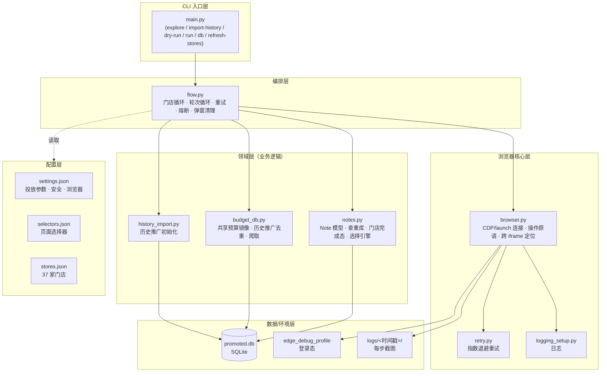
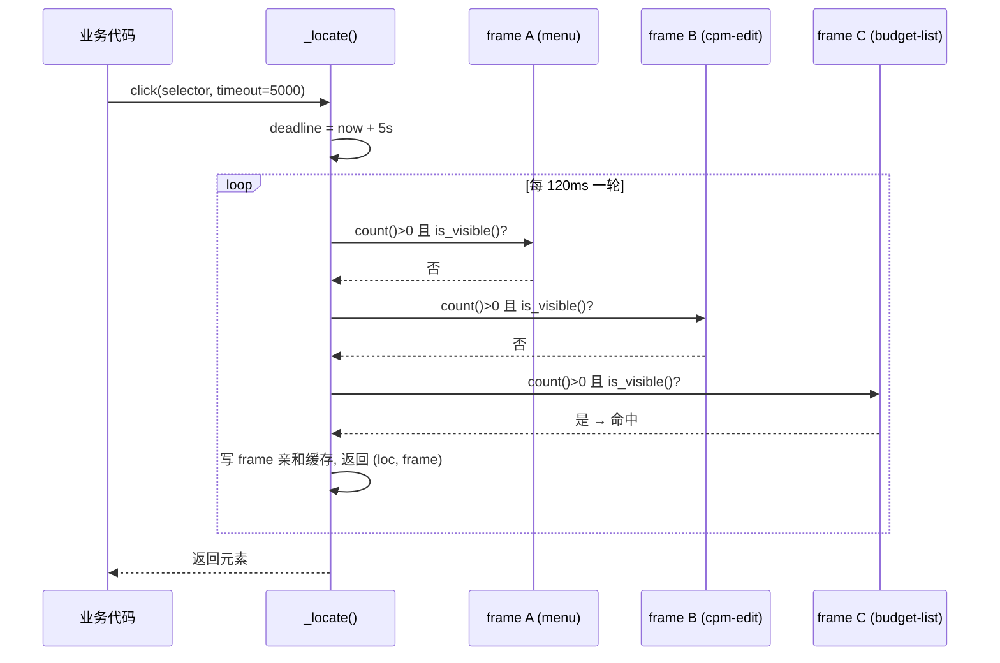
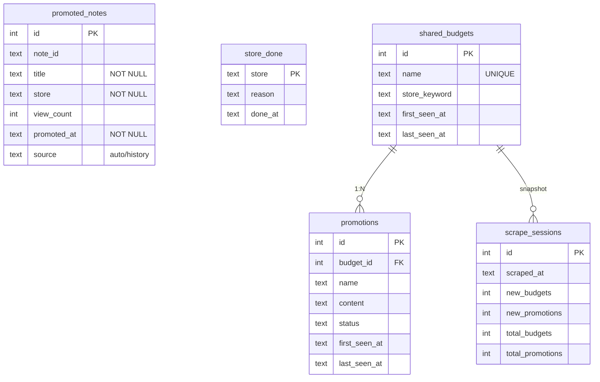
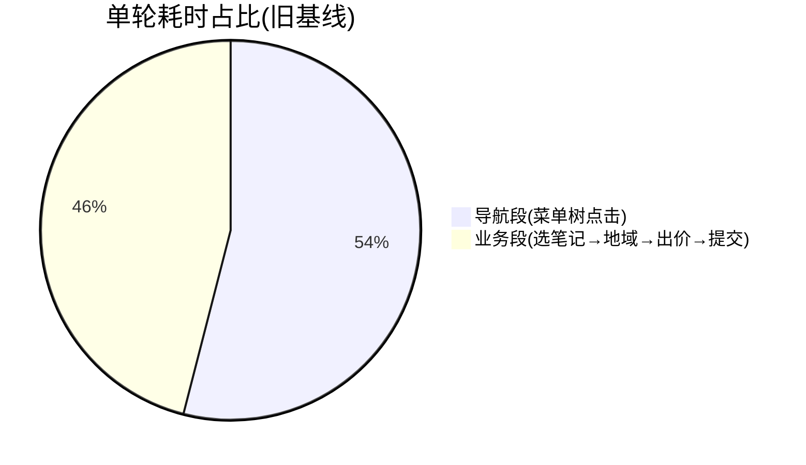

# 美团经营宝 · 笔记推广自动化（mt-note-promoter）

> 一套**纯规则脚本**，用于在美团/点评「经营宝 → 智选展位 → 共享预算 → 内容种草」链路下，
> 自动把每个门店**浏览量最高、且尚未推广过的笔记**推到「门店 6km 半径、单次点击出价 1.1 元」的投放计划里。
>
> 设计目标：**确定性高、零 LLM 调用、全程截图留痕、自动去重、失败即停不静默提交**。

---

## 目录

1. [项目简介](#1-项目简介)
2. [项目背景](#2-项目背景)
3. [解决了什么问题](#3-解决了什么问题)
4. [技术栈](#4-技术栈)
5. [系统架构](#5-系统架构)
6. [核心业务流程](#6-核心业务流程)
7. [数据模型与去重机制](#7-数据模型与去重机制)
8. [页面选择器与探测机制](#8-页面选择器与探测机制)
9. [运行模式（CLI）](#9-运行模式cli)
10. [配置说明](#10-配置说明)
11. [部署与运行步骤](#11-部署与运行步骤)
12. [已解决的工程问题](#12-已解决的工程问题)
13. [性能分析与优化路线](#13-性能分析与优化路线)
14. [已知问题与待优化项](#14-已知问题与待优化项)
15. [目录结构](#15-目录结构)
16. [测试](#16-测试)
17. [风险、合规与凭证安全](#17-风险合规与凭证安全)
18. [后续演进路线](#18-后续演进路线)

---

## 1. 项目简介

`mt-note-promoter` 是一个 **RPA（机器人流程自动化）脚本**，基于 Playwright + CDP 驱动一个**已人工登录**的 Edge 浏览器，
模拟运营人员在美团经营宝后台的点击操作，完成「新建推广 → 内容种草 → 选笔记 → 设地域 → 定向人群 → 出价 → 提交」的全流程。

| 维度 | 说明 |
|------|------|
| 核心价值 | 把 37 家门店 × 数十条笔记的人工投放，变成「一条命令 + 一次确认」 |
| 决策方式 | **纯规则**（浏览量降序 + 精确去重），**不引入 LLM**，保证确定性与零推理成本 |
| 投放策略 | 共享预算 / 内容种草 / 门店附近推广 6km / 定向人群（9项自定义标签）/ 单次点击出价 ¥1.1 / 每次选 1 篇 |
| 安全机制 | 每日上限、出价上限、自动去重、失败立即停、提交前可人工确认 |
| 可观测性 | 每一步自动截图到 `logs/<时间戳>/`，失败定位到具体断点 |

---

## 2. 项目背景

运营方在美团经营宝后台管理一个密室/剧本杀/解压类**连锁品牌**的多个门店（当前 `config/stores.json` 收录 **37 家**门店，
分布于徐家汇、长宁来福士、五角场、金鹰、月亮湾等商圈）。

每个门店在「**共享预算**」下都有独立的推广组，运营需要为门店挑选合适的**探店笔记**进行「内容种草」投放：

- 笔记数据只有「**浏览量 + 发布日期**」两个弱信号，没有标题语义、品类、正文质量等丰富特征；
- 目标很明确——**优先推高曝光笔记**，且**同一篇笔记不能重复投放**；
- 人工逐店逐笔记地：进后台 → 找预算组 → 新建推广 → 选笔记 → 设范围/出价 → 提交，
  是一个高频、重复、易漏、易重复的劳动密集流程。

因此，项目选择**纯规则脚本**而非 AI 方案：筛选已推广 → 按浏览量降序 → 取 top 1。
这规避了 LLM 调用开销与结果不确定性，满足「执行确定、成本可控、可批量」的工程诉求。

---

## 3. 解决了什么问题

| 痛点 | 解决方式 |
|------|----------|
| 人工逐店操作慢、易漏推/重推 | 一条命令遍历门店列表，自动跑完所有门店 |
| 同一篇笔记重复投放浪费预算 | 双层去重：`promoted_notes`（本工具提交过）+ `promotions`（共享预算历史内容），精确同标题匹配 |
| 不确定推了哪些、漏了哪些 | SQLite 查重库 + `store_done` 缓存，下次运行自动跳过已确定性推完的门店；`--db` 可随时查看 |
| 流程中途崩了不知道卡在哪 | 每步截图 + 结构化日志；`TODO_EXPLORE` 未回填的选择器会先截图再明确报错停止，绝不静默提交 |
| 浏览量高但标题被截断导致错推 | 统一标题归一化（`_normalize_title`）、优先 `note_id` 精确匹配、匹配失败**抛异常终止**而非默认提交 |
| 多门店重复打开整条导航（每轮 60s+） | 直达 URL 跳过四级菜单树（实测 2.4s~10s 到位）；`store_done` 缓存跳过已完成门店（0 秒） |
| 跨 iframe 元素定位慢且易失败 | `_locate()` 改为「单一全局 deadline + 全 frame 每轮短轮询 + frame 亲和缓存」 |

---

## 4. 技术栈

| 分类 | 选型 | 说明 |
|------|------|------|
| 语言 | **Python 3.13** | 标准库为主，无重型框架 |
| 自动化 | **Playwright 1.61.0（sync API）** | `pip install playwright` 后即可用 |
| 连接方式 | **CDP（Chrome DevTools Protocol）** | 连接已人工登录的 Edge（`--remote-debugging-port=9222`），登录态持久化在 `data/edge_debug_profile` |
| 浏览器 | **Microsoft Edge（channel=msedge）** | 连接本机已开浏览器，避免每次重新登录；亦支持 launch 模式用自带 Chromium |
| 存储 | **SQLite（`data/promoted.db`）** | 单文件数据库，零部署，承载去重库、共享预算镜像、门店完成态 |
| 配置 | **JSON**（`config/*.json`） | 选择器、门店、投放参数全外置，改配置不动代码 |
| 日志 | 标准库 `logging` | 控制台 INFO + 文件 DEBUG 双通道；每 run 一个目录 |
| 重试 | 自研 `retry_on_failure` 装饰器 | 指数退避（1s→2s→…） |
| 测试 | **pytest** | `tests/test_notes.py` 覆盖解析/选择/去重纯逻辑 |
| 第三方依赖 | **仅 `playwright`** | 其余全为标准库，依赖面极窄 |

> 设计取舍：刻意保持依赖最小。整个项目除 Playwright 外不依赖任何第三方包，降低维护与分发成本。

---

## 5. 系统架构

### 5.1 分层视图



### 5.2 关键组件职责

| 模块 | 职责 | 关键函数 |
|------|------|----------|
| `browser.py` | 浏览器连接、操作原语（`click/fill/hover/wait/shot`）、跨 iframe `_locate`、人审暂停 | `Browser.__enter__/__exit__`、`_locate`、`_guard`、`pause_for_human` |
| `flow.py` | 主流程编排：导航 → 爬取 → 选门店 → 选笔记 → 地域/出价 → 提交；弹窗通用清理 | `run`、`_promote_one_store`、`_do_post_store_steps`、`_dismiss_modals`、`_select_store` |
| `notes.py` | `Note` 数据类、SQLite 去重库（`promoted_notes`）、门店完成态（`store_done`）、纯规则选择引擎 | `is_promoted/mark_promoted`、`select_best_note`、`parse_views` |
| `budget_db.py` | 共享预算表镜像（`shared_budgets`/`promotions`）、历史推广去重、增量爬取 | `scrape_and_upsert`、`list_promoted_contents_for_budget`、`count_active_promotions` |
| `history_import.py` | 阶段1：把后台历史推广灌入查重库，作为去重基线 | `run()` |
| `safe_db.py` | SQLite 安全访问层：默认只读，写操作需显式开启并留审计；依据 `data-classification.yaml` 做字段级写保护 | `SafeDB`、`DangerousSQL` |
| `retry.py` | 指数退避重试装饰器 | `retry_on_failure` |
| `main.py` | 命令行入口与模式分发 | `main()`、`explore()` |

### 5.3 为什么需要跨 iframe 定位

美团经营宝是典型的 **SPA + 多 iframe** 页面（同时挂载 5~8 个 iframe：左侧菜单、内容区、cpm-edit、budget-group-list 等）。
`page.locator()` 只搜主文档，**几乎找不到任何业务元素**，必须遍历 `page.frames` 定位。
`_locate()` 的设计要点：



> **关键改进**：旧实现「先赌活跃 frame 等满 timeout，再逐个 frame 各等满 timeout」，命中第 3 个 frame 时
> 耗时 ≈ `timeout×2 + 命中时间`（实测等工具箱 tab 达 32s）。新实现「单一 deadline + 全 frame 短轮询」，
> 总耗时 = 元素真实就绪时间，并引入**选择器→frame 亲和缓存**让二次调用近乎零成本。

---

## 6. 核心业务流程

### 6.1 单门店推广主流程

1. 启动 Edge（CDP 连接），确保登录态
2. 导航到共享预算页（直达 URL 跳过菜单树）
3. 增量爬取预算列表，写入 budget_db
4. 按 budget_keyword 定位门店预算行 → 悬停 → 新增推广 → 去新建推广
5. cpm-edit 表单：选推广目的 = 内容种草
6. 选门店：叉掉旧标签 → 搜索 → 选中 → 面包屑提交
7. 等待笔记卡片自动渲染
8. 点笔记「修改」→ 打开笔记选择抽屉
9. 抓取候选笔记（标题 + 浏览量 + data-id）
10. **去重过滤**（查重库 + 历史推广，精确同标题）→ 按浏览量降序取 top1
11. 浏览量 ≥ 门槛(400)？否 → 标 `store_done(views_below_min)` 跳下一家
12. 确认修改 → 关弹窗 → 等抽屉关闭
13. 设推广地域：门店附近区域 6km（抽屉流程）
14. **设定向人群**：点定向 radio → 查看/修改 → 自定义标签 9 项 → 保存设置 → 抽屉关闭
15. 设出价：单次点击 1.1
16. 下一步 → 创意页
17. 提交：`dry-run` 保存为草稿（不写库）/ `run` 保存并提交（成功→写查重库）
18. 返回结果，继续同店下一轮

### 6.2 门店级与轮次级循环

1. `run()` 加载配置 + 校验 → `ensure_login`
2. 遍历 `stores.json` 中 enabled 门店
3. 已标 `store_done`？→ 跳过（0 秒）
4. 有 `budget_keyword`？→ 否则跳过
5. 单门店轮次循环：`_promote_one_store`
6. 瞬态失败且 round < 2？→ 重试该店
7. 无可用笔记？→ 标 `store_done` 停止该店
8. 推广中达上限？→ 标 `store_done` 停止该店
9. 否则继续轮次，直到完成 → 进入下一家门店
10. 全部遍历完 → 汇总结果

> **瞬态失败自动重试**：`note_card_not_rendered` / `drawer_not_open` / `no_notes_in_drawer` / `note_modify_click_fail`
> 等页面抖动类错误，在同一次 run 内自动重试 1 次；确定性失败（匹配失败、无可用笔记、达上限）则停止该店，绝不空转。

### 6.3 定向人群（主流程内置，2026-08-07 新增）

主流程在「推广地域 → 出价」之间插入**定向人群**修改（页面顺序：地域下一行即推广人群区域），与批量脚本共用同一套已验证逻辑：

1. 点「定向人群」radio（value=1）
2. 点「查看/修改」打开人群抽屉
3. 抽屉切「自定义人群标签」页签
4. 勾选 9 项：年龄 `14-24岁 / 25~29岁 / 30~34岁` + 性别 `男 / 女` + 兴趣 `轰趴 / 密室 / 团建拓展 / 新奇体验`（先展开左侧「休闲娱乐」分类）
5. 点「保存设置」（真实鼠标点击，重试 3 次）→ **确认抽屉关闭**（保存生效）
6. **不点「保存并提交」**——由主流程继续点「下一步」→ 创意页 → 保存并提交（与原有主流程一致）

- 失败策略：人群修改任何环节失败仅打印 `[WARN]`，**继续主流程**（不阻塞提交）
- `--dry-run`（保存为草稿）模式**同样执行**人群修改
- 实现：`src/flow.py::_set_crowd_targeting()`，复用 `scripts/batch_target_audience.py` 的 helper

---

## 7. 数据模型与去重机制

所有数据落在单文件 SQLite `data/promoted.db`，共 5 张表，分属三个关注点：



### 7.1 双层去重（防止同一篇笔记重复投放）

| 层 | 数据源 | 匹配规则 | 作用 |
|----|--------|----------|------|
| 第一层 | `promoted_notes` | 优先 `note_id`（仅真实 `data-id`，拒绝 `card-N` 序号）精确匹配；否则 `title + store` 精确匹配 | 本工具**本次/历次**提交过的笔记，永不重推 |
| 第二层 | `promotions`（共享预算镜像） | 候选笔记标题与历史推广内容**精确同标题匹配**（去掉「门店优质笔记」前缀比前 30 字） | 后台在工具介入**之前**已投过的笔记，也跳过 |

> **踩坑修正**：早期用「主题关键词子串」模糊过滤，会误伤同主题不同笔记；现改为**精确同标题**。
> 早期 `note_id` 退化成 `card-N`（抽屉位置序号）会跨店冲突，现已限定只有真实 `data-id` 才用于查重。

### 7.2 门店完成态（`store_done`）

仅当「确定性推完」才标记，**瞬态失败不标记**，否则会漏推：

- `no_unpromoted_notes`：该店全部笔记已推广 → 直接跳过（0 秒，不驱动浏览器）
- `views_below_min(<400)`：最高浏览量已低于门槛 → 后面更低，直接跳过

下次 `--run` 命中 `store_done` 即跳过，节省大量导航时间。`--refresh-stores` 可清除标记强制重扫。

---

## 8. 页面选择器与探测机制

所有页面元素定位集中在 `config/selectors.json`，与代码解耦。标记 `TODO_EXPLORE` 的选择器**必须先在「阶段0 探测」中回填**，
否则运行到该步骤会：

1. 先截图 `TODO_EXPLORE_blocked.png`（让你看到卡在哪一步）；
2. 抛 `RuntimeError` 明确提示「选择器未回填」，并请用户发来当前页面截图以便回填；
3. **绝不静默往下走**（避免错推/重推）。

```jsonc
{
  "login":   { "logged_in_indicator": "TODO_EXPLORE: ..." },
  "nav":     { "promotion_center": "text=推广中心", "shared_budget": "span[title=\"共享预算\"]" },
  "shared_budget_page": { "budget_row_name_cell": "tr...:has-text(\"{budget_keyword}\") ..." },
  "create_promotion": {
     "note_item": "div.premium-notes-card-container",
     "note_title": ".note-title-text",
     "region_nearby": "text=门店附近区域",
     "distance_input": "div.merchant-drawer__container.promo-city-draw input...",
     "bid_input": ".N-price-mode-detail input.merchant-input-number__input",
     "submit_success_indicator": "TODO_EXPLORE: 提交成功标识"
  },
  "creative_page": { "page_indicator": "TODO_EXPLORE: ...", ... },
  "history": { "promotion_list_entry": "TODO_EXPLORE: ..." }
}
```

> **当前仍待回填（TODO_EXPLORE）**：`login.*`、`creative_page.*`、`history.*`、`submit_success_indicator`。
> 这些项会走「降级/跳过 + 截图」逻辑，不阻断已跑通的主流程（26 步已全跑通）。

---

## 9. 运行模式（CLI）

```bash
python src/main.py --explore           # 阶段0: 打开浏览器供人工登录 + 页面探测(只读)
python src/main.py --import-history    # 阶段1: 爬取历史推广, 初始化查重库
python src/main.py --dry-run           # 阶段2: 演练模式, 填完所有内容但不提交(存草稿)
python src/main.py --run               # 阶段3: 正式运行(提交前按 auto_submit 决定是否确认)
python src/main.py --db                # 查看查重库内容
python src/main.py --refresh-stores    # 清除门店 done 标记(新增笔记后强制重扫)
# 仅处理指定门店(覆盖 stores.json):
python src/main.py --run --store "鬼十八恐怖密室逃脱·真人NPC·沉浸解压(长宁来福士店)"
```

| 模式 | 用途 | 是否写库 | 是否真实提交 |
|------|------|----------|--------------|
| `--explore` | 人工登录 + 探测页面（只读） | 否 | 否 |
| `--import-history` | 把后台已有推广灌入查重库 | 是（history 源） | 否 |
| `--dry-run` | 演练：填完但存草稿 | 否 | 否（保存为草稿） |
| `--run` | 正式投放 | 是（提交后写 `auto`） | 是（`auto_submit=true` 时全自动；否则提交前终端确认） |
| `--db` | 查看去重库 | 否 | 否 |

### 9.1 批量修改推广人群（独立脚本，2026-08-07）

针对**智选展位已有推广**做批量人群改造（把「智选人群」批量改成「定向人群 + 自定义标签 9 项」），与主流程独立：

```bash
# 批量修改（默认 100条/页 × 前 3 页，已定向自动跳过）
python scripts/batch_target_audience.py --max-pages 3
# 强制修复指定推广（跳过已定向判断，不管状态直接走完整修改流程）
python scripts/fix_ids.py
# 单条执行（处理第一个未定向推广，供人工验证）
python scripts/fix_one.py
# 验证指定推广真实状态（定向? 9项标签完整?）
python scripts/verify_one.py 推广202608052d2
python scripts/verify_batch.py <推广ID1> <推广ID2> ...
```

| 关键点 | 说明 |
|--------|------|
| 复用 CDP 登录态 | 与主流程同一套 Edge 调试浏览器，先 `start_edge_debug.bat` |
| 进度断点续跑 | `data/batch_target_audience_progress.json`（processed_ids 跳过 / failed 重试） |
| 提交确认 | 点「保存设置」（真实点击+抽屉关闭确认）→「保存并提交」→ 右侧弹窗点「继续提交」→ 以「提交成功」为准 |
| 100条/页 | 选项文本带空格（"100 条/页"），脚本已做去空格匹配 |
| 已知失败模式 | 个别推广「兴趣标签懒加载未渲染」（展开休闲娱乐后轰趴等未出现）→ 5/9 保护跳过提交，需手动（见 `手动处理清单.md`） |

### 9.2 推广报表生成（2026-08-05）

投放完成后可一键生成按门店分类的统计报表（CSV + XLSX），数据源为 `data/promoted.db`：

```bash
python gen_report.py
# 输出: reports/推广笔记统计_<日期>.csv + .xlsx
```

---

## 10. 配置说明

### 10.1 `config/settings.json`

```jsonc
{
  "portal_url": "https://e.dianping.com/",
  "direct_urls": { "budget_list": "https://e.dianping.com/app/peon-cpm-ncpm/html/budget-group-list.html" },
  "skip_full_scrape": { "enabled": true },     // DB 已有历史数据时可跳过全量爬取加速
  "promotion": {
    "purpose": "内容种草",
    "region_mode": "门店附近推广",
    "distance_km": 6,                            // 投放半径 6km
    "bid_per_click": 1.1,                       // 单次点击出价 ¥1.1
    "notes_per_run": 1                          // 每次选 1 篇
  },
  "note_selection": { "strategy": "max_views", "min_views": 400 },  // 仅推浏览量≥400
  "safety": {
    "auto_submit": false,                        // false=提交前人工确认; true=全自动
    "max_promotions_per_day": 500,               // 每日投放上限兜底
    "max_bid_allowed": 2.0,                      // 出价安全上限
    "max_rounds_per_store": 3
  },
  "browser": {
    "connect_mode": "cdp", "cdp_port": 9222,
    "cdp_user_data_dir": "data/edge_debug_profile",
    "channel": "msedge", "headless": false,
    "slow_mo_ms": 300, "default_timeout_ms": 60000
  }
}
```

### 10.2 `config/stores.json`

37 家门店，每条含：`name`（美团后台全名）、`search_keyword`（下拉搜索词）、`budget_keyword`（定位共享预算行的关键词）、`enabled`（是否参与）。
`budget_keyword` 为 `null` 表示该店在共享预算表中无对应预算组，运行时自动跳过并提示。

### 10.3 `config/selectors.json`

页面选择器全集，见 §8。

---

## 11. 部署与运行步骤

> 前置：本机已安装 Edge，`pip install -r requirements.txt`（仅 `playwright==1.61.0`）。
> Python 运行环境示例：`C:\Users\pc\.workbuddy\binaries\python\envs\default\Scripts\python.exe`
> （或项目早期使用的 `envs\mtpromoter`）。

**第一步：以调试模式启动 Edge（开启 CDP 端口 + 持久化登录态）**

双击 `start_edge_debug.bat`，或在 PowerShell 中：

```powershell
Start-Process "C:\Program Files (x86)\Microsoft\Edge\Application\msedge.exe" `
  -ArgumentList "--remote-debugging-port=9222","--user-data-dir=$PWD/data/edge_debug_profile","--no-first-run"
```

> ⚠️ 必须用**非默认** `user-data-dir`，否则 Chromium 安全限制会拒绝开启调试端口。
> 首次启动需在浏览器里完成登录；登录态保存在 `data/edge_debug_profile`，后续复用。
> **运行期间不要关闭 Edge**，关闭会中断任务。

**第二步：按节奏执行**

```bash
cd D:\Version1\mt-note-promoter
PY=python   # 指向你的 venv/python

$PY src/main.py --explore          # 首次: 人工登录 + 探测(只读)
$PY src/main.py --import-history   # 初始化查重库(需先回填相关选择器)
$PY src/main.py --dry-run          # 演练: 填完不提交
$PY src/main.py --run              # 正式: 真实提交(或提交前确认)
$PY src/main.py --db               # 随时查看去重库
```

---

## 12. 已解决的工程问题

| # | 问题 | 根因 | 修复 |
|---|------|------|------|
| 1 | 缓存续跑导致 SPA 状态错乱 | 旧缓存/续跑逻辑 | 删除整套缓存，每次完整重跑 |
| 2 | 关门店下拉触发表单重置（目的/门店回退默认） | 旧版点空白处关闭 | 改点面包屑 `.cpm-edit-bread-wrapper` 提交选择 |
| 3 | 笔记卡片不渲染 | cpm-edit frame 未加载完就操作 | 等 frame 加载 + 超时自动叉掉门店重选（最多 3 轮） |
| 4 | 推广地域/出价无法设置 | 选择器未回填 | 回填抽屉流程选择器（门店附近区域 6km / 出价 1.1） |
| 5 | 门店写死、改代码低效 | 硬编码门店名 | `config/stores.json` 门店列表（37 家），自动遍历 |
| 6 | 预算行在第 2 页找不到 | 只查第 1 页 | 逐页翻查（最多 6 页） |
| 7 | 门店下拉匹配失败（中/英文括号差异） | 完整名 has-text 易失配 | 品牌词 + 分店词双关键词枚举匹配 |
| 8 | 3 条推广都是同一篇「新手基础」 | 标题截断 80 字 vs 完整标题比较 → 永远失配 → 静默提交默认 | 统一归一化；`note_id` 优先、标题次之；**匹配失败抛异常终止** |
| 9 | 提交后弹窗挡住「下一步」 | 旧处理只覆盖部分弹窗类型 | 通用弹窗清理 `_dismiss_modals()`，覆盖所有可见 modal/dialog，兜底 ESC |
| 10 | 400+ 浏览量笔记被误判跳过 | `card-N` 假 ID 跨店冲突 | 仅真实 `data-id` 查重；清理 28 条 `card-N` 脏数据 |
| 11 | 历史推广按主题关键词模糊过滤误伤 | 同主题不同笔记被当重复 | 改为**精确同标题匹配** |

---

## 13. 性能分析与优化路线

基线（2026-07-31 实测，单店 6 条笔记连推）：稳定态单轮 ≈ **115s**，含重试均值 ≈ **187s/条**。



已落地 / 待落地的优化项：

| 优化项 | 优先级 | 现状 | 优化后 | 状态 |
|--------|--------|------|--------|------|
| `_locate` 改全 frame 短轮询 + 亲和缓存 | P0 | 63s | 8s | ✅ 已在 `browser.py` 落地 |
| 直达 URL 跳过四级菜单树 | P0 | 60s | 2~10s | ✅ 已落地（`direct_urls.budget_list`） |
| `slow_mo_ms` 300 → 0 | P0 | 12s | 0s | ⏳ **仍 300，建议下调**（先 100 观察） |
| 38 处 `time.sleep` → 条件等待 | P1 | 35s | 8s | ⏳ 待替换（分批 dry-run 验证） |
| 同门店连推免重导航 | P1 | 每轮全量 | 复用列表页 | ⏳ 部分生效 |
| 截图降级（仅关键/失败节点） | P2 | 25 张/轮 | 4 张/轮 | ⏳ 待做 |
| 细粒度重试 + 门店级熔断 | P2 | 失败 −120s | 失败 −20s | ⏳ 待做 |

> **预期收益**：单轮 **115s → 35~40s（约 3 倍提速）**；
> 全量 35 家门店测算由约 **73 小时** 降至约 **19 小时**（仍建议分批 5~8 家执行）。

完整方案见 [`ARCHITECTURE_OPTIMIZATION.md`](./ARCHITECTURE_OPTIMIZATION.md)。

---

## 14. 已知问题与待优化项

1. **「去新建推广」悬停按钮偶发找不到**（Aug 3 运行日志复现）：
   预算行 hover 后弹层中的「去新建推广」按钮 `text=去新建推广` 有时未出现，`_open_new_promotion` 重试 3 次失败。
   → 需增强 hover 弹层的等待/重试（等待「更多/新增推广」按钮可见后再点，而非固定 sleep）。
2. **`slow_mo_ms` 仍为 300**：调试遗留，每个原子操作 +300ms，单轮约 40 次 = 12s 纯浪费，建议归零或降到 100ms。
3. **`TODO_EXPLORE` 选择器未回填**：`login.*` / `creative_page.*` / `history.*` / `submit_success_indicator`，
   目前走降级逻辑，不影响主流程但缺少「提交成功」客观校验。
4. **全量 35 家门店的体量与排期**：每家约 30~50 条 ×（优化后）~50s ≈ 每家 0.5~1h，35 家累计数十小时，必须分批执行。
5. **每日上限 `max_promotions_per_day`**：全量跑时需确认是否调大（当前 500）。
6. **后台遗留重复推广**：修复前 bug 造成的 3 条「新手基础」重复推广，需人工在美团后台删除（自动化无权删后台推广）。
7. **导航稳定性**：每轮导航可能失败 1~2 次（重试可恢复），单轮偏慢，见 §13。
8. **脆弱的 hover 类交互**：菜单 hover、预算行 hover 等依赖 CSS/JS hover 弹层，是主要不稳定来源，建议优先改为可直接 `goto`/点击的入口。
9. **批量人群脚本的「兴趣标签懒加载」**（2026-08-07）：个别推广展开「休闲娱乐」后轰趴/密室/团建拓展/新奇体验标签未渲染（虚拟列表懒加载），勾选不足 5/9 保护跳过提交 → 需手动（见 `手动处理清单.md`）。
10. **浏览器被关中断**：批量任务运行期间若关闭/重启 Edge 或人工操作浏览器，会报 `Target page closed` 中断；重跑（进度断点续跑）即可恢复。

---

## 15. 目录结构

```
mt-note-promoter/
├── config/
│   ├── settings.json      # 投放参数 / 安全 / 浏览器连接
│   ├── selectors.json      # 页面选择器(含 TODO_EXPLORE 占位)
│   └── stores.json         # 37 家门店列表
├── src/
│   ├── main.py             # CLI 入口
│   ├── flow.py             # 主流程编排(含 _set_crowd_targeting 定向人群)
│   ├── browser.py          # 浏览器连接 + 跨 iframe 定位 + 操作原语
│   ├── notes.py            # Note 模型 + 查重库 + 选择引擎
│   ├── budget_db.py        # 共享预算镜像 + 爬取
│   ├── history_import.py   # 历史推广初始化
│   ├── safe_db.py          # SQLite 安全访问层(默认只读+写审计+字段级保护)
│   ├── retry.py            # 指数退避重试
│   └── logging_setup.py    # 日志
├── scripts/
│   ├── batch_target_audience.py   # 批量修改推广人群(定向+自定义标签9项)
│   ├── batch_crowd_targeting.py   # 批量人群改造(另一版本)
│   ├── fix_ids.py                 # 指定推广强制修复(跳过已定向判断)
│   ├── fix_one.py                 # 单条执行(供人工验证)
│   ├── verify_one.py / verify_batch.py / verify_audience.py  # 验证脚本
│   └── probe_*.py                 # 页面结构探测脚本(login/drawer/edit/frame/list/scroll/state…)
├── tests/
│   └── test_notes.py       # pytest 单测(解析/选择/去重)
├── data/
│   ├── promoted.db         # SQLite 去重库(单一数据源, gitignore)
│   ├── batch_target_audience_progress.json  # 批量人群任务进度断点
│   ├── edge_debug_profile/ # 登录态(CDP 模式, gitignore)
│   └── browser_profile/    # launch 模式登录态(gitignore)
├── reports/                # 推广统计报表(CSV+XLSX, gen_report.py 生成)
├── logs/                   # 运行目录, 每步截图(gitignore, 本地保留)
├── process.yaml            # 业务流程定义(唯一真源, PROCESS.md 由其渲染)
├── data-classification.yaml # 数据分级(L0~L3, safe_db.py 写保护依据)
├── gen_report.py           # 推广报表生成脚本
├── diag_chongwen.py        # 崇文门店预算行 hover 诊断脚本
├── verify_direct_url.py    # 直达 URL 可用性只读验证
├── start_edge_debug.bat    # 一键启动 Edge 调试模式
├── PROCESS.md              # 业务流程文档(27步, 由 process.yaml 渲染)
├── ARCHITECTURE_OPTIMIZATION.md  # 性能诊断与重构方案
├── PROJECT_STATUS.md       # 项目状态报告
├── 手动处理清单.md          # 批量人群任务失败项(人工填写)
└── README.md               # 本文档
```

---

## 16. 测试

```bash
cd D:\Version1\mt-note-promoter
python -m pytest tests/ -q
```

`tests/test_notes.py` 覆盖纯逻辑（不触浏览器）：`parse_views`（万/逗号/纯数）、`select_best_note`（最高浏览量、top-N、过滤已推广、全已推广）、
数据库去重（mark/check/unmark、title+store 去重、按店过滤、重复 mark 幂等）。数据库通过临时文件隔离，每个用例独立。

---

## 17. 风险、合规与凭证安全

- **平台合规**：自动化操作美团经营宝后台属于对第三方平台的脚本化访问，请遵守美团开放平台/商家后台的《服务协议》，
  仅用于**自有门店**的合规运营，控制频率与投放量，避免触发风控或违规。
- **登录态与凭证**：登录态保存在本地 `data/edge_debug_profile`，**不要提交到任何仓库或外发**。
  `config/` 中不含任何账号密码 / API token。若对话中粘贴过 `ntn_` 等敏感 token，请尽快在对应平台轮换。
- **安全兜底**：`safety` 配置提供每日上限、出价上限、提交前人工确认（`auto_submit=false`），
  默认**不自动提交**，正式投放前建议先 `--dry-run` 演练。
- **失败即停**：任何未回填选择器、匹配失败、抽屉未开等异常都会**明确报错并截图**，绝不静默提交默认内容。

---

## 18. 后续演进路线

**批次A（短期，收益占 70%）** → **批次B（中期）** → **批次C（结构重构）** → **补全 TODO_EXPLORE** → **批量调度**

- **短期（批次 A，收益占 70%）**：`slow_mo_ms` 归零、剩余 `time.sleep` 条件化、增强「去新建推广」hover 等待。
- **中期（批次 B/C）**：`flow.py` 拆分出 `pages/`（budget_list / promo_edit / notes_drawer / modals），
  让页面交互可单测、编排瘦身到 200 行内。
- **长期**：补全提交成功客观校验；引入轻量调度（分批、定时、进度汇总）与失败告警。

---

> 文档基于 2026-08-05 代码状态整理（含主流程定向人群、批量人群脚本、报表生成、安全数据层）。运行细节以 `ARCHITECTURE_OPTIMIZATION.md`、`PROJECT_STATUS.md`、`PROCESS.md` 及 `logs/` 实测为准。
